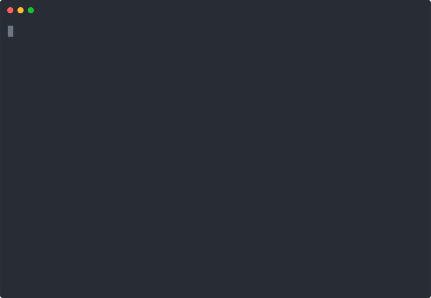

# 500wallpaper

Download wallpapers and lock screens from 500px website.

<p align="center">
  
</p>

## Installation

- Clone this repo.
- Run `yarn` or `npm install`.
- Run `yarn link` or `npm link`

## Usage

Run `500wallpaper` without argument to download the recently added photo with the highest Pulse from 500px website.

View the list of options using `500wallpaper --help`:

```
Usage: 500wallpaper [options]

Options:
  -V, --version                  output the version number
  -f, --feature <featureName>    photo stream to be retrieved
  -c, --category <categoryName>  category to return photos from (case sensitive, separate multiple values with a comma)
  -w, --width <minWidth>         minimum width of the photo to be downloaded
  -H, --height <minHeight>       minimum height of the photo to be downloaded
  -l, --landscape                the photo must be in landscape orientation
  -o, --output <fileName>        destination file name without extension
  -h, --help                     output usage information

Features:
  popular, highest_rated, upcoming, editors, fresh_today, fresh_yesterday, fresh_week

Categories:
  Uncategorized, Abstract, Aerial, Animals, Black and White, Celebrities, City and Architecture, Commercial, Concert, Family, Fashion, Film, Fine Art, Food, Journalism, Landscapes, Macro, Nature, Night, Nude, People, Performing Arts, Sport, Still Life, Street, Transportation, Travel, Underwater, Urban Exploration, Wedding

Examples:
  $ 500wallpaper
  $ 500wallpaper -o wallpaper
  $ 500wallpaper -f editors -c Landscapes -H 2048 -l -o ~/Images/wallpaper}
  $ 500wallpaper -f popular -c "City and Architecture,Landscapes,Nature,Travel" -H 4096 -l
```
